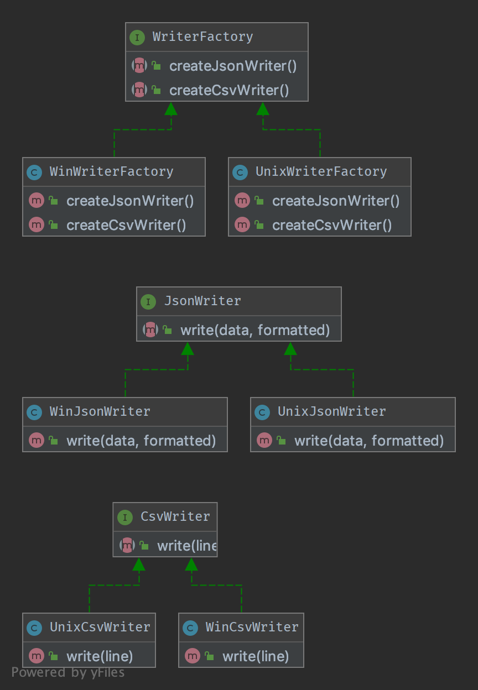

# 1.1. Abstract Factory

## 1.1.1. Purpose

To create series of related or dependent objects without specifying their concrete classes. Usually the created classes all implement the same interface. The client of the abstract factory does not care about how these objects are created, it just knows how they go together.

Để tạo một loạt các đối tượng liên quan hoặc phụ thuộc mà không chỉ định các lớp cụ thể của chúng. Thông thường những class được tạo sẽ triển khai một interface. Khách hàng của nhà máy trừu tượng không quan tâm về làm thế nào để tạo ra những đối tượng đó, chúng chỉ cần biết cách sử dụng là đủ.

## 1.1.2. UML Diagram

## Code sample

